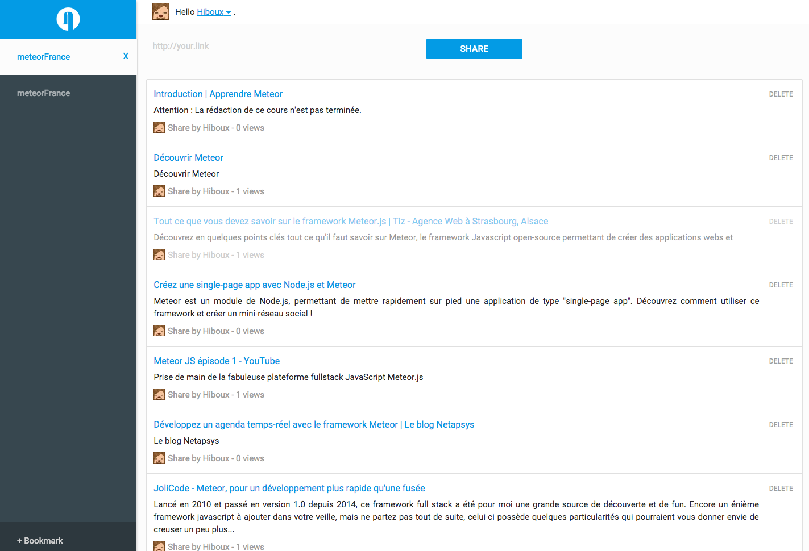

# Welcome to Bookmark-meteor !



Meteor? What's this?
Meteor is a complete open source platform for building web and mobile apps in pure JavaScript. [https://www.meteor.com/](https://www.meteor.com/) .

Instal :

1 - Install meteor.

2 - Download bookmark-meteor.

3 - Run it locally:
```bash
cd bookmark-meteor
meteor
```


Test live Bookmark-Meteor here : [http://bm.meteor.com/](http://bm.meteor.com/)
